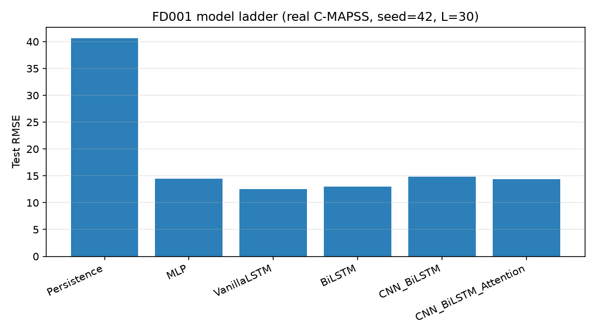
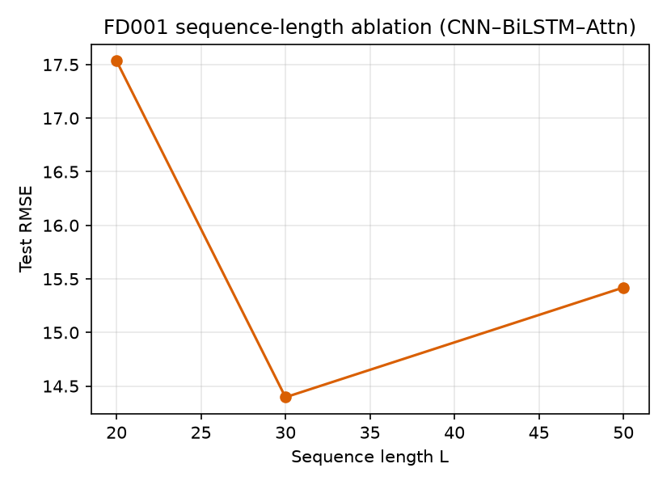
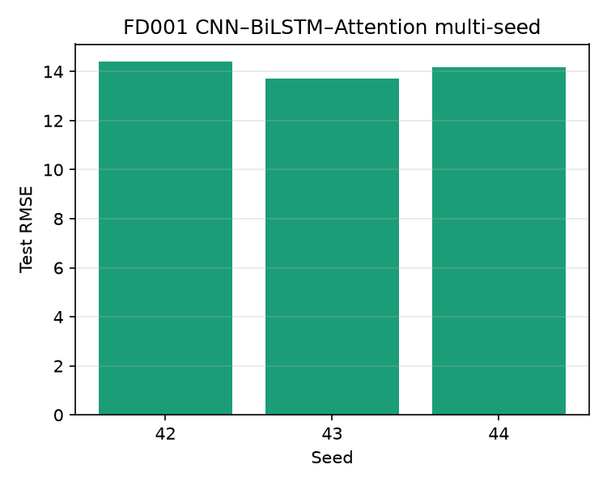
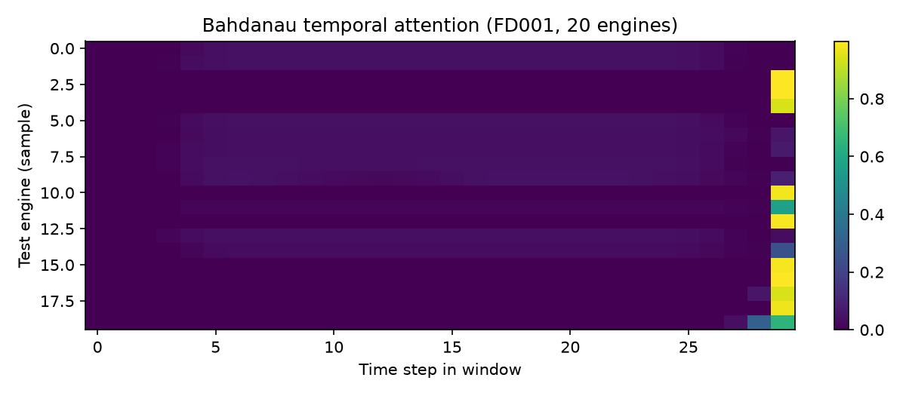

# Hybrid CNN–BiLSTM with Temporal Attention for Multi-Horizon RUL on NASA C-MAPSS

**Author:** Hossein Tabasi ([GitHub](https://github.com/hosseinTabasi))  
**License:** MIT  
**Repository:** [`cnn-bilstm-attention-rul-cmapss`](https://github.com/hosseinTabasi/cnn-bilstm-attention-rul-cmapss)

Technical portfolio implementation of a hybrid convolutional–recurrent RUL estimator with Bahdanau temporal attention, evaluated on the NASA C-MAPSS turbofan datasets (FD001–FD004).

> **Data note:** Results in this README were produced on **real NASA C-MAPSS** (`synthetic=0` in `experiments/results/metrics.csv`). If `data/raw/SYNTHETIC_DATA.txt` is present in a local run, treat metrics as synthetic and **not** comparable to published benchmarks.

## Abstract

Remaining Useful Life (RUL) estimation is a core prognostics and health management (PHM) task. This repository provides a complete, reproducible PyTorch pipeline for **multi-horizon** RUL prediction on **C-MAPSS**, featuring:

- Piecewise RUL targets with \(R_{\mathrm{early}}=125\) (configurable)
- Engine-level train/validation splits (**no engine leakage**) and **train-only** StandardScaler
- Model ladder: Persistence → MLP → VanillaLSTM → BiLSTM → CNN_BiLSTM → **CNN_BiLSTM_Attention**
- Bahdanau (additive) temporal attention with exported attention weights
- From-scratch **ManualLSTMCell** / **ManualLSTM** with unit tests against `torch.nn.LSTM`
- Official asymmetric **C-MAPSS score** (+ RMSE, MAE)
- Experiments 1–6 with CSV metrics and figures

## Method

1. **CNN front-end** (1D Conv + BatchNorm + ReLU stacks) extracts local sensor patterns from windows of length \(L\).
2. **Bidirectional LSTM** models long-range degradation dynamics.
3. **Bahdanau attention** pools the BiLSTM hidden sequence into a context vector; a linear head predicts RUL at horizons \(\{1,5,10\}\).
4. Optional **fail-in-30** binary head can be enabled via config.

## Repository layout

```text
cnn-bilstm-attention-rul-cmapss/
├── README.md
├── LICENSE                          # MIT, © Hossein Tabasi
├── requirements.txt
├── environment.yml
├── configs/                         # default, FD001, FD003, ablation
├── data/
│   ├── raw/                         # gitignored — run download script
│   ├── processed/
│   └── sample/                      # tiny excerpt for smoke tests
├── notebooks/01_exploration.ipynb
├── src/
│   ├── data/          # download, synthetic fallback, preprocess, dataset
│   ├── models/        # baselines, CNN-BiLSTM, attention, lstm_cell
│   ├── training/      # Trainer
│   ├── evaluation/    # metrics (incl. C-MAPSS score), plots
│   └── utils/         # seed, config
├── scripts/           # download_data, train, run_experiments, …
├── experiments/results/             # metrics CSVs + checkpoints
├── figures/
└── tests/             # metrics + ManualLSTM vs nn.LSTM
```

## Setup

```bash
python -m venv .venv
source .venv/bin/activate   # Windows: .venv\Scripts\activate
pip install -r requirements.txt
```

Conda alternative:

```bash
conda env create -f environment.yml
conda activate cnn-bilstm-attention-rul
```

## Data

NASA **C-MAPSS** turbofan degradation simulation (FD001–FD004).

```bash
python scripts/download_data.py
```

The downloader tries the NASA data portal zip, an S3 mirror, then a public per-file research mirror of the official `.txt` files. If all fail, a **synthetic multi-engine degradation** fallback is written and marked with `data/raw/SYNTHETIC_DATA.txt` — label every table in that case.

Piecewise RUL: \(\mathrm{RUL} \leftarrow \min(\mathrm{RUL}, R_{\mathrm{early}})\) with default \(R_{\mathrm{early}}=125\`.

## Quick start

```bash
# Train main model on FD001
python scripts/train.py --model CNN_BiLSTM_Attention --subset FD001 --epochs 40

# Full experiment campaign (CPU-friendly defaults)
python scripts/run_experiments.py --epochs 30

# Tests
pytest -q
```

## Experiments

| ID | Description |
|----|-------------|
| 1 | Model ladder on FD001 |
| 2 | Multi-horizon heads \(\{1,5,10\}\) (reported per model in CSV) |
| 3 | Sequence length ablation \(L \in \{20,30,50\}\) |
| 4 | ManualLSTM vs VanillaLSTM (`nn.LSTM`) |
| 5 | Multi-seed stability (42, 43, 44) |
| 6 | FD003 confirmation run (main model) |

**Training defaults (CPU):** hidden 64, batch 64, ~25–30 epochs, early stopping patience 8–10.

## Results (real C-MAPSS)

Protocol: last window per test engine; piecewise RUL with \(R_{\mathrm{early}}=125\); \(L=30\) unless noted; seed 42 unless noted. Metrics from `experiments/results/metrics.csv`.

### FD001 — model ladder (Exp 1)

| Model | RMSE | MAE | C-MAPSS Score |
|-------|------|-----|---------------|
| Persistence | 40.69 | 35.00 | 19887.15 |
| MLP | 14.44 | 10.59 | 411.38 |
| VanillaLSTM | **12.56** | **9.49** | **233.35** |
| BiLSTM | 13.01 | 9.75 | 287.58 |
| CNN_BiLSTM | 14.84 | 10.84 | 471.68 |
| CNN_BiLSTM_Attention | 14.40 | 10.46 | 483.70 |

Under this modest CPU budget (hidden=64, ≤30 epochs), **VanillaLSTM** is the strongest FD001 entry. The hybrid attention model improves over CNN_BiLSTM alone but does not beat a well-tuned plain LSTM here — an honest outcome, not a claim of SOTA.



### FD001 — multi-horizon RMSE (Exp 2, from Exp 1 runs)

| Model | h=1 | h=5 | h=10 |
|-------|-----|-----|------|
| VanillaLSTM | 12.56 | 12.45 | 12.59 |
| BiLSTM | 13.01 | 12.86 | 12.92 |
| CNN_BiLSTM_Attention | 14.40 | 14.39 | 14.52 |

### FD001 — sequence length ablation (Exp 3)

| L | RMSE | MAE | Score |
|---|------|-----|-------|
| 20 | 17.53 | 12.64 | 793.79 |
| 30 | 14.40 | 10.46 | 483.70 |
| 50 | 15.42 | 11.13 | 392.13 |



### ManualLSTM vs nn.LSTM (Exp 4)

| Model | RMSE | MAE | Score | Epochs |
|-------|------|-----|-------|--------|
| VanillaLSTM (`nn.LSTM`) | 14.72 | 10.55 | 473.85 | 25 |
| ManualLSTM (custom cell) | 13.71 | 9.85 | 364.82 | 25 |

Numerical gate equivalence is covered by `tests/test_lstm_cell.py` (weights copied, `allclose`). End-to-end scores differ due to independent optimization trajectories and the slower Python timestep loop.

### Multi-seed stability (Exp 5) — CNN_BiLSTM_Attention, FD001

| Seed | RMSE | MAE | Score |
|------|------|-----|-------|
| 42 | 14.40 | 10.46 | 483.70 |
| 43 | 13.72 | 10.08 | 291.56 |
| 44 | 14.17 | 9.69 | 536.11 |
| **Mean ± std** | **14.09 ± 0.35** | | |



### FD003 — main model (Exp 6)

| Model | RMSE | MAE | Score |
|-------|------|-----|-------|
| CNN_BiLSTM_Attention | 13.50 | 8.90 | 795.63 |

### Attention interpretability



## Metrics

- **RMSE / MAE** on piecewise-clipped RUL at the last test window.
- **C-MAPSS asymmetric score** for residual \(d = \hat{y} - y\):

\[
s = \sum_i
\begin{cases}
e^{-d_i / 13} - 1 & d_i < 0 \quad \text{(late)} \\
e^{d_i / 10} - 1 & d_i \ge 0 \quad \text{(early)}
\end{cases}
\]

Implemented in `src/evaluation/metrics.py` with unit tests.

## Configuration

See `configs/default.yaml`. Key knobs: `dataset.r_early`, `dataset.sequence_length`, `dataset.horizons`, `model.hidden_dim`, `training.epochs`, `training.seed`.

## Citation

```text
Tabasi, H. (2026). Hybrid CNN–BiLSTM with Temporal Attention for
Multi-Horizon RUL on NASA C-MAPSS.
https://github.com/hosseinTabasi/cnn-bilstm-attention-rul-cmapss
```

## Acknowledgments

NASA Prognostics Center of Excellence for releasing the C-MAPSS turbofan degradation datasets.
